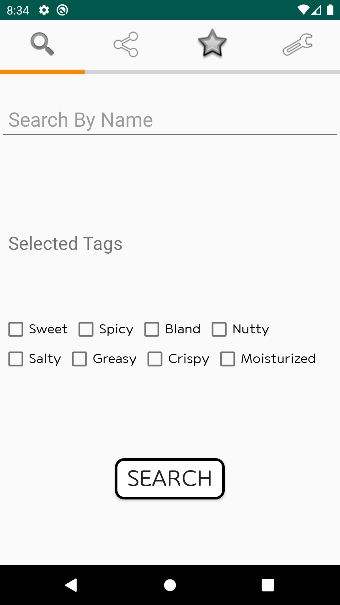
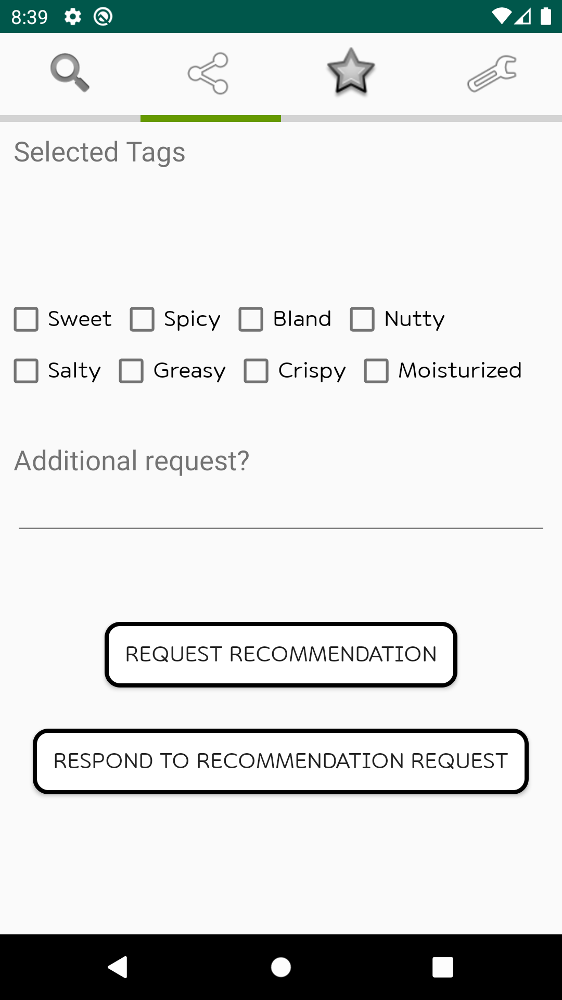
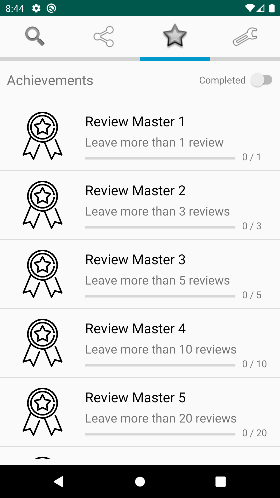
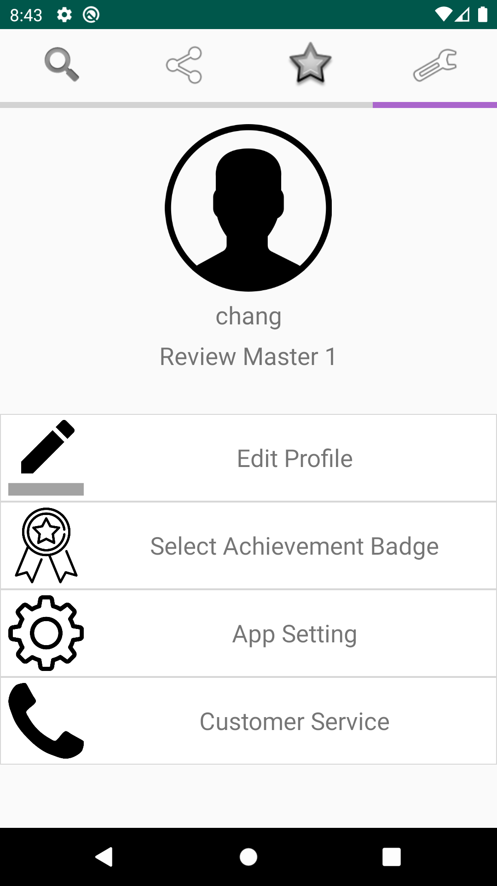
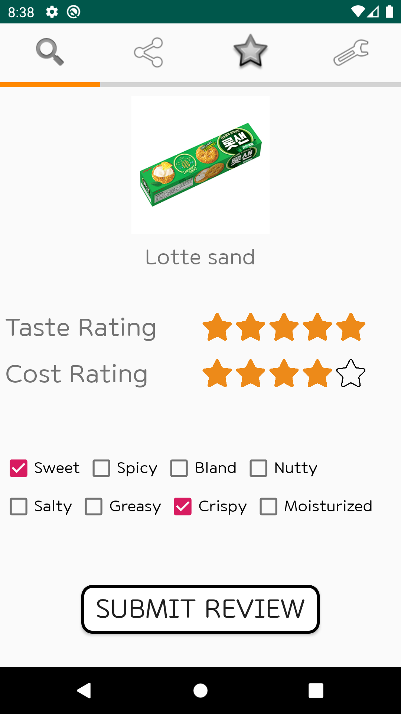
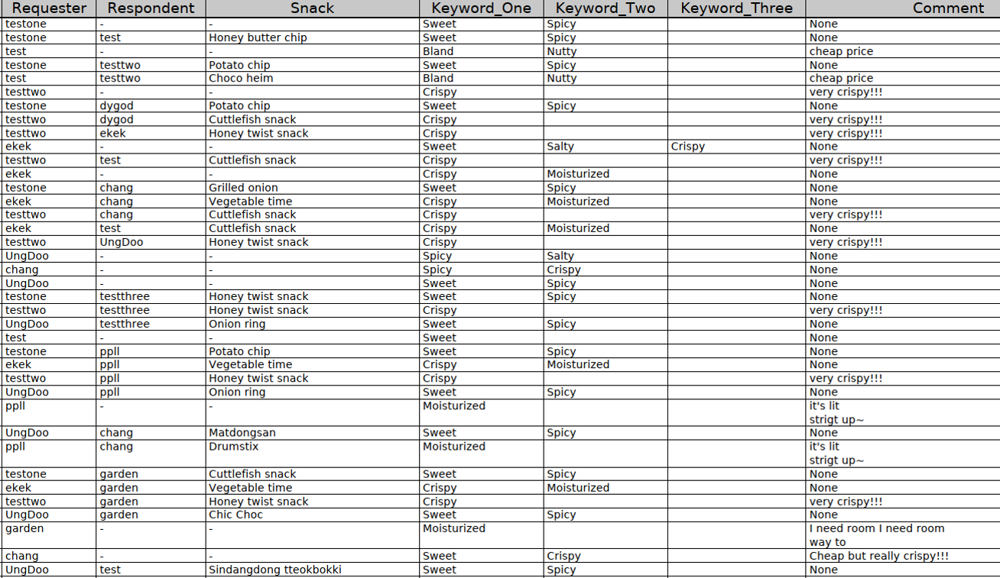

# CS473 Final Report by COOK-King

### Team Member

​	Changgeon Ko, 20170031 / Kihwan Shin, 20170354 / Chanyoung Chung, 20170608

### Final video URL

[Final Video](https://www.youtube.com/watch?v=oCpJWz9oc3Q)

### Quality arguments

​	"It is easy to use!" "Simple and light application!" These are the comments we heard from the users. And these evaluations perfectly match our purposes. We decided on our main theme as ‘snack,’ which is an object that everyone easily accesses and feel comfortable. Moreover, snack consumers might not spend much time on snacks but consider frequently about snacks. Thus, we thought that the system we were planning to make should never be complicated or burdensome. It should be simple and easy to use, and the users should be able to obtain the information they want quickly. Suppose a user uses the system before he or she starts to go to the store. Then the users should be able to use the system on the way to the store, and the results should appear before the user arrives at the store. The reasons we chose a mobile phone application for our system and all the works to express all functions using the minimum number of menus are all related to our initial thoughts. Thanks to such efforts, we were able to design the system where the single usage time is short while the frequency might be high.

</img> </img> </img> </img>
 
​	Besides, our system needs to gather as much information as possible because the taste and cost efficiency of each snack is a subjective value different from each user. Therefore, we needed plenty of opinions to generalize the results into public opinions that a majority of people might agree with. However, we found that most of the current review system contains areas for writing comments. Based on our experiences, even though there are some incentives or benefits that users can get after they write some reviews, many users think writing comments annoying, so we remove it and design the review system simpler. In the current design, the users only have to click up to five times to express their feelings.

</img>     </img>
 
​	Additionally, most of the current information-sharing or rating system does not offer real-time user-user recommendation. To use those services, the users have to input their information. Assume that the user is using a restaurant recommending service. Then the system might require the location of residence, age, taste, etc. This kind of inserting data is sometimes annoying for users, and users may want to get recommendation which is irrelevant to the pre-inserted data. We removed beforehand input of personal taste so that the users can always find the results. And if there is something particular to consider, the user can add additional comments on requests.

### Evaluation

​	After the High-fi prototype stage, it took longer than expected to modify the application based on the feedback we received. Furthermore, because it was an exam period, our team did not have enough time to advertise our system. Alternatively, we promoted the system to friends, who were easy to recruit and still included in our targets. Before the final presentation, we recruited 10 people, and after that, we additionally recruited 5 more people to collect user's behavior data. This number of a user is not enough to accurately evaluate the effect of each function of the system, such as the recommendation system. But we tried to observe the users as carefully as possible.

</img>
 
​	Because of the absence of experience of observing users, we did not know what should be stored, so we just recorded the history of recommendations and reviews (with keywords). The above image is a screenshot of part of the history of recommendation. Among the users, 'test', 'testone', 'test two' are the only accounts made by us to show users what comes out when clicking the respond button, and the rest requester/respondent is from real users. Unfortunately, we could not record the exact time when they review some snacks or respond to recommendation responses. However, we observed that the majority of users make reviews of a single snack or answer to the snack recommendation requests in 10 seconds. It was so short that users did not feel burdensome to respond to multiple requests at once. Since it is too short, it might seem like trolling, but when we asked the users, they said they could choose the appropriate snacks fast thanks to the order of the snack list: users can sort snacks by scores of tastes and cost-efficiency. Thankfully, these results and observations are what we want: we wanted to make a light application which did not take too much time.

​	Among the 15 users, there were no negative responses such as 'I do not understand why this kind of application is needed.' Most of them said that it is interesting and they might use it when some aspects are modified. For instance, when users search snacks or try to respond to other users' recommendation requests, the snack list is not shown well: even though it should show multiple instances, it sometimes printed 'No results.' In addition, as this application is very light after more snacks are added to the database and more people participate to accumulate data, the users said they are willing to use it frequently (or whenever they feel bored).

### Discussion

​	First of all, as the goal of this project is to perform social computing through our own system, we tried to gather opinions of many people through crowdsourcing in order to obtain 'agreeing', 'sympathizing', or 'collective' knowledge. In other words, our system tried to find near objective scores for each snack. Most of the existing applications only focus on menus on restaurants, not on snacks. Interestingly, the taste of cuisines used in a restaurant might be different according to the chief, but the taste of the snack is constant since it is made in factories. Thus, we thought that it is possible to find out the 'objective' taste of each snack, and started to design a 'brand new' application. After some investigations, we realized that it is actually possible to achieve our goals. To do that, we needed lots of taste data of each snack and unfortunately, we did not have them; there are lots of snacks in the school store that all of us and our friends never have tried. In addition, to prevent trolling, we need lots of opinions or reviews from many users, but we did not have such data. Thus, we had no choice but to insert some fake data, which means that our tests might not work well.

​	Second, we intended to provide communication between users through responses to recommendation requests, not direct communication or chatting. The users can share their opinions about snacks with regard to particular situations. We could find out that this feature works well because the test users said that they may follow the responses. This real-time recommendation is not familiar in the cooking area, especially in the snack area. We think that this kind of system can ease decision disorder and encourage buying not-ever-tried snacks.

​	Moreover, by using multiple keywords, we tried to decrease the impact of trolling of choosing random keywords through dispersing it, achieving quality control. At the first developing stage, we used only four keywords, and we added four more keywords after we made it to some degree. In the process, we could see the more dispersion of chosen keywords. Unfortunately, however, we wanted to add many more keywords about taste, but because of our short English, we failed to translate the taste-related Korean words into English. For example, we often use 'DanZzan DanZzan' or 'Jjapjjarum' in Korean, but it is translated as 'sweet and salty, sweet and salty' and 'salty', which are different from original meanings. Since we did not have enough keywords, we could not make a word cloud using them, which was our first goal.

​	The third menu of our application is 'Achievement', which exists to motivate users to participate. In fact, some users said that it is exciting to have some missions like that. However, we thought that it might not have enough impact to motivate participation because there is no additional gamification or incentive.
