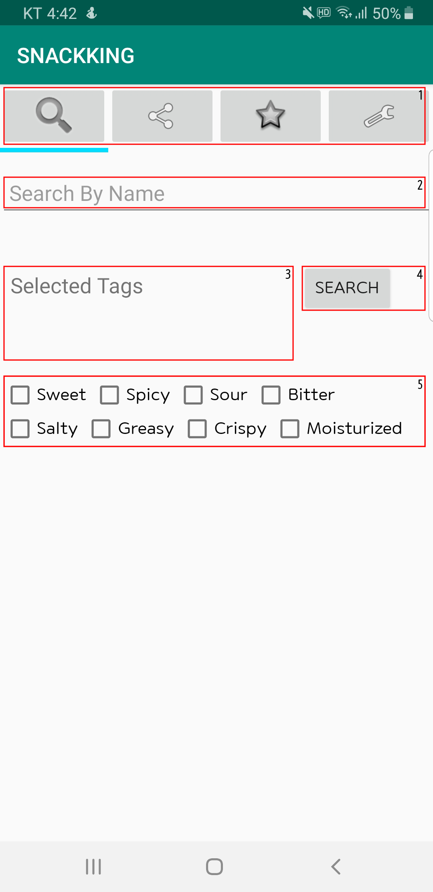
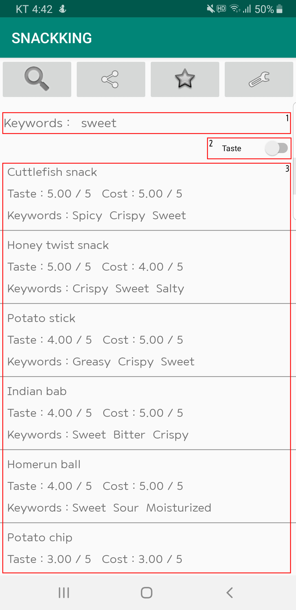
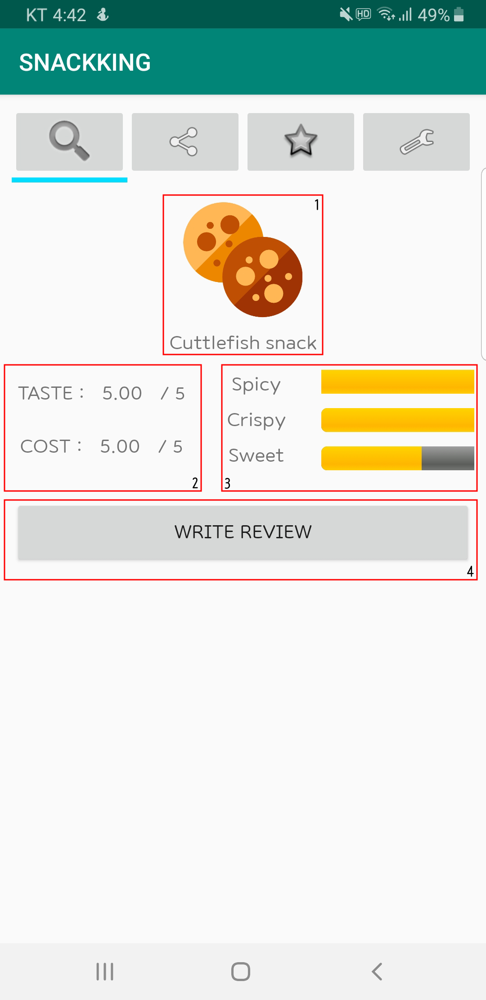
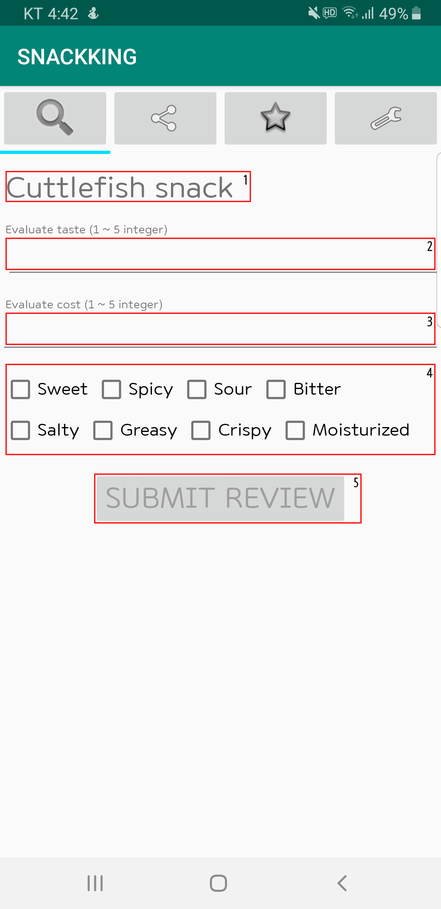
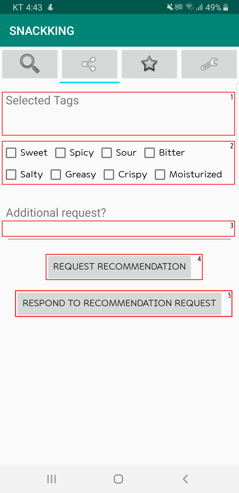
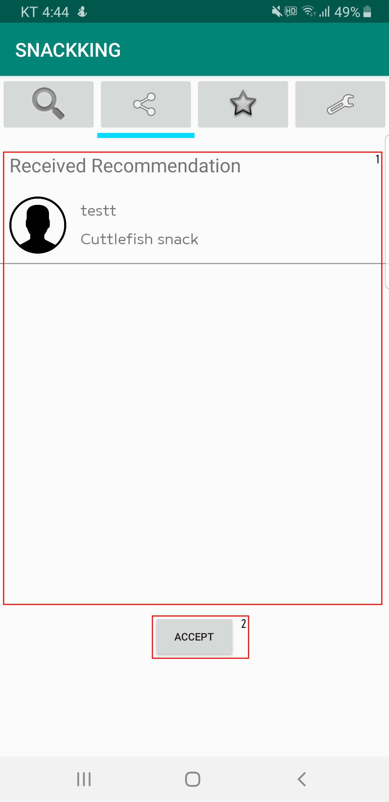
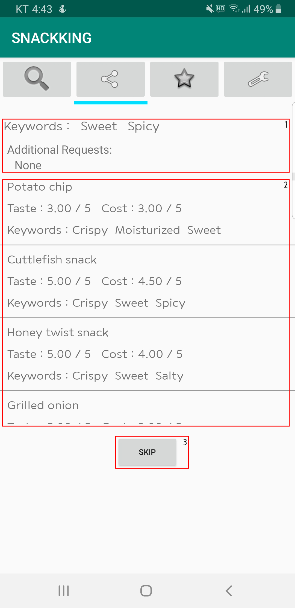
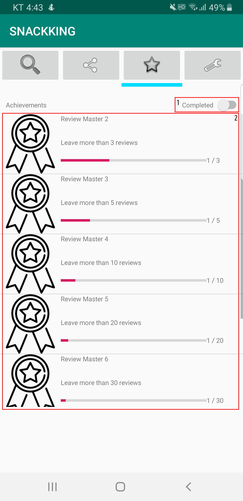

# High-Fi Prototype by COOK-King

### Project Summary

​	Not having enough information about snacks makes people feel indecisive and stressed when choosing satisfactory products. Our application, **"SNACK-King"**, provides organized information about snack and shares recommendations between users. Users can refer to keyword-based reviews with ratings and distribution graphs, request snack recommendation using keywords and comments, and respond to others' recommendation requests. 

### Instruction

#### 1. Search System

##### 1.1. Search Main Page

</img>

1. User can move to the corresponding pages by clicking the ImageButton. (Search, Recommendation, Achievement, Setting, responsibly.)
2. User can input text to search snacks.
3. User can see keywords they choose.
4. User can push **Search** button to search.
5. User can choose at most three keywords to search.

##### 1.2. Search Result Page

</img>

1. User can see the selected keywords from the previous page.
2. User can sort the result by taste rating or cost rating. Default is taste.
3. Show the list of snacks from searching. User can go to each **Snack Information Page** by clicking the region of each snack.

##### 1.3. Snack Information Page

</img>

1. Show the image and name of current snack.
2. Show taste rating and cost rating from users.
3. Show three most keywords reviewed from users.
4. User can go to **Snack Review Page** by clicking the button.

###### 1.4. Snack Review Page

</img>

1. Show the name of current snack.

2. User can input taste rating. (integer between 1 and 5)

3. User can input cost rating. (integer between 1 and 5)

4. User can choose at most three keywords for review.

5. User can submit their review by clicking **Submit Review** button.

   

#### 2. Recommendation System

##### 2.1. Recommendation Main Page

</img>

1. User can see keywords they choose.
2. User can choose at most 3 keywords for recommendation request.
3. User can input additional text for recommendation request.
4. User can send request by clicking the button. This button is active when user chooses at least one keyword. After clicking this button, the page changes into **Recommendation Receive Page**.
5. User can receive recommendation request by clicking **Respond to Recommendation Request** button.

##### 2.2. Recommendation Receive Page

</img>

1. User can see recommendations from other users.
2. User can close the recommendation request by clicking **Accept** button.

##### 2.3. Recommendation Response Page

</img>

1. User can see the requirements of recommendation request.

2. User can see the list of snacks satisfying the recommendation condition.

3. User can skip the recommendation request.

   

#### 3. Achievement System

</img>

1. User can change mod to **Completed**. By this toggle, user can filter completed / not completed achievements.

2. Show the list of achievements, corresponding badges and complete rates.

   

### URL of our Prototype

[**Prototype**](https://www.dropbox.com/s/wxrxbqtw37grx61/Snack_King_1.0.1.apk?dl=0)

### URL of our Git Repository

[**Git Repository**](https://github.com/pencaty/SNACKKING)

### Libraries and Frameworks

* **Android Studio** (JAVA, XML)

* Free hosting server from **[dothome](https://www.dothome.co.kr/)**

* **PHP** for connecting application and database

* **MySQL** for database management

* <b>FileZilla</b> for sending PHP files to the server

